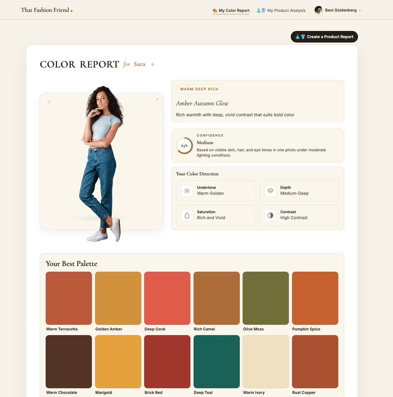
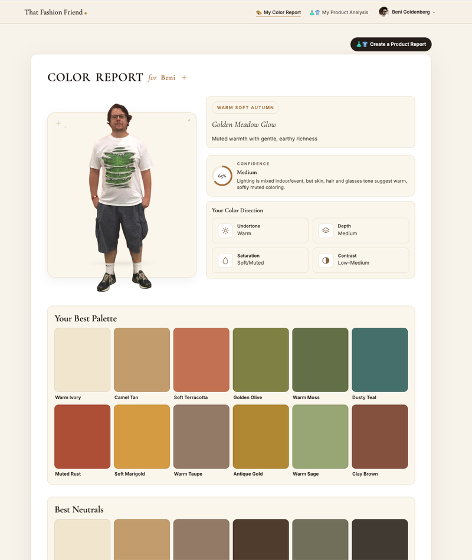
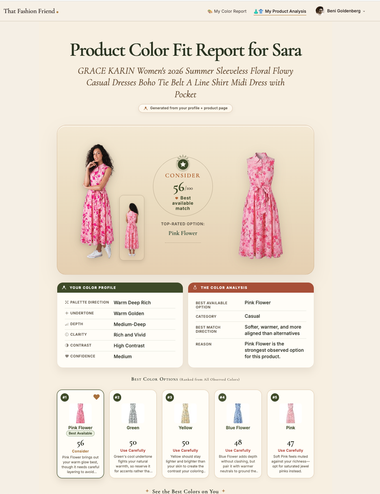
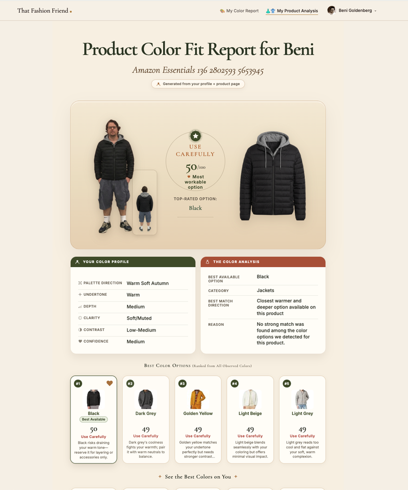

# That Fashion Friend

> Upload one photo and get a personal color analysis, then check any clothing product page against your palette with a one-click Product Color Fit Report, right from a Chrome extension.

**Live app → [that-fashion-friend.vercel.app](https://that-fashion-friend.vercel.app)**

**Demos**
- [That Fashion Friend on Stitch Fix and Polo Ralph Lauren](https://www.loom.com/share/07735aa7cbcf4d82bd6327dad5f3f158)
- [That Fashion Friend on Amazon (extension sidebar)](https://www.loom.com/share/c247ddc2a4f549419ca2c3a27f6bc861)

---

## What it does

That Fashion Friend (TFF) is a fashion-tech web app and Chrome extension that helps people shop online with confidence. It has two core outputs:

1. **Personal Color Analysis (PCA)** — from a single full-body photo, TFF determines your undertone, depth, saturation and contrast, assigns a seasonal palette direction, and shows your best colors and neutrals.
2. **Product Color Fit Report** — paste or capture any product URL and TFF ranks every color the product is sold in against your palette, visualizes the product on you, and gives a clear verdict: **BUY**, **Consider**, **Careful** or **Skip**.

The Chrome extension is a thin launcher: it signs you in, picks which color profile to analyze under, captures the current tab's product URL, and hands off to the report pipeline.

---

## Screenshots

### Personal Color Report

Two different profiles, two different palettes. Same template, fully personalized.

| Warm Deep Rich — *Amber Autumn Glow* | Warm Soft Autumn — *Golden Meadow Glow* |
|:---:|:---:|
|  |  |

### Product Color Fit Report

The product is shown on you, scored, and ranked against every color option the retailer offers.

| A floral midi dress (verdict: Consider) | A puffer jacket (verdict: Use Carefully) |
|:---:|:---:|
|  |  |

---

## How it works

1. **Install the extension** and sign in with Google.
2. **Onboard once** on the web app: upload a full-body photo, which is reviewed and approved or rejected with a clear reason, background-removed, and used to generate your Personal Color Analysis.
3. **Shop anywhere.** On a product page, open the extension. It captures the URL and best-effort color-variant hints from the page.
4. **Get your report.** TFF scrapes the product, scores each color against your profile, composites the product onto you, and renders a printable one-page report.

---

## Architecture: four-layer determinism

The guiding principle of TFF is to use AI only where it is irreplaceable, and to keep everything else deterministic and testable. Every piece of content in a report belongs to one of four layers:

| Layer | Content | Examples |
|---|---|---|
| **L1** | Static assets | SVGs, palette JSONs, design tokens |
| **L2** | Scraped content | Product title, colors, images |
| **L3** | Stored profile data | Undertone, depth, palette season |
| **L4** | AI-generated content | Only what can't be produced any other way, always behind strict guardrails |

Design rules that follow from this:

- **The LLM never generates HTML or layout.** AI is limited to specific content and image slots; reports render through a deterministic HTML/CSS pipeline.
- **Zod before persist.** Character limits, copy lengths and payload invariants are enforced server-side before anything is stored or rendered.
- **Image variants via compositing, not regeneration.** Product color variants are produced with HSV masking on a controlled base image rather than extra AI calls.
- **Move content down the layers when possible.** For example, the "Look for These Instead" section moved from LLM-generated (L4) to a static palette lookup keyed by season (L1).
- **Subsystem isolation.** CSS/layout work never touches the image pipeline, and vice versa.
- **One vocabulary.** The pipeline's verdict system (BUY / Consider / Careful / Skip) is the source of truth for all UI and marketing copy.

---

## Tech stack

| Layer | Technology |
|---|---|
| Frontend | Next.js 15 (App Router), TypeScript (strict), Tailwind CSS |
| Auth | Google OAuth via Supabase |
| Database | Supabase (Postgres) with Drizzle ORM |
| Validation | Zod |
| Workflow orchestration | n8n (async pipelines) |
| AI (images) | Replicate (Flux Kontext), gpt-image-2 |
| Image processing | sharp compositing, remove.bg / rembg for cutouts |
| Product scraping | Firecrawl, Browserless |
| Testing | Playwright golden-screenshot regression tests |
| Extension | Chrome Extension (Manifest V3), `chrome.identity.launchWebAuthFlow` |
| Deployment | Vercel |

Supabase is the single identity and data store shared by the web app and the extension.

---

## Chrome extension

The extension is intentionally minimal. It does **not** host onboarding, photo upload, or report rendering.

- Authenticates with Google OAuth, brokered through Supabase
- Resolves which named color profile to analyze under (multi-profile accounts supported)
- Captures the current tab's product URL plus best-effort DOM variant hints
- Hands off to the live report pipeline on the web app

### Post-auth routing

| User state | Destination |
|---|---|
| New or incomplete profile | `/onboarding` |
| Returning user with at least one complete profile | `/dashboard` |
| Logout | `/` |

---

## Testing

Reports are held to a canonical design template rendered at **816px width, DPR 2**. Playwright golden screenshots act as regression guards for both the report template and the extension popup states, so layout changes can't silently break the design.

```bash
npx playwright test
```

---

## Local development

```bash
# Install dependencies
npm install

# Start the Next.js dev server
npm run dev
```

The full pipeline (scraping, image generation, compositing) requires Supabase, n8n and third-party API credentials. Copy `.env.example` to `.env.local` and fill in your own keys. Never commit secrets.

---

## Project status

TFF is a completed portfolio project. It is published here to showcase the product thinking, spec-driven workflow and architecture behind it.

---

## About

Built by [Beni Goldenberg](https://github.com/bgoldenberg), a Senior Product Manager working across AI/ML products, growth and consumer platforms. Product planning and specs were written spec-first; implementation was done with Claude Code.

*Color analysis results are estimates based on a single photo and lighting conditions, and are meant as styling guidance rather than a definitive assessment.*
